# Codex Wallpaper Skin

English | [简体中文](README.md)

An independent Windows 11 x64 desktop application that adds local images, videos, and installed Wallpaper Engine projects as Codex Desktop backgrounds. The first public Beta is `0.8.0` and requires the official x64 `OpenAI.Codex` Store/MSIX package.

The application uses a loopback-only Chrome DevTools Protocol (CDP) session to add a reversible background layer to the real Codex page. Codex loads Image/Video media independently; complex Scene projects are rendered natively by a private local Wallpaper Engine window and transferred to Codex. The application does not patch `WindowsApps`, `app.asar`, the official signature, chats, or authentication data.

> This is an unofficial project and is not affiliated with or endorsed by OpenAI, Valve, or Wallpaper Engine.

See the [v0.8.0 Release Notes](docs/releases/V0.8.0-BETA.md) for the first public Beta's changes, download guidance, and limitations.

## Showcase

<p align="center">
  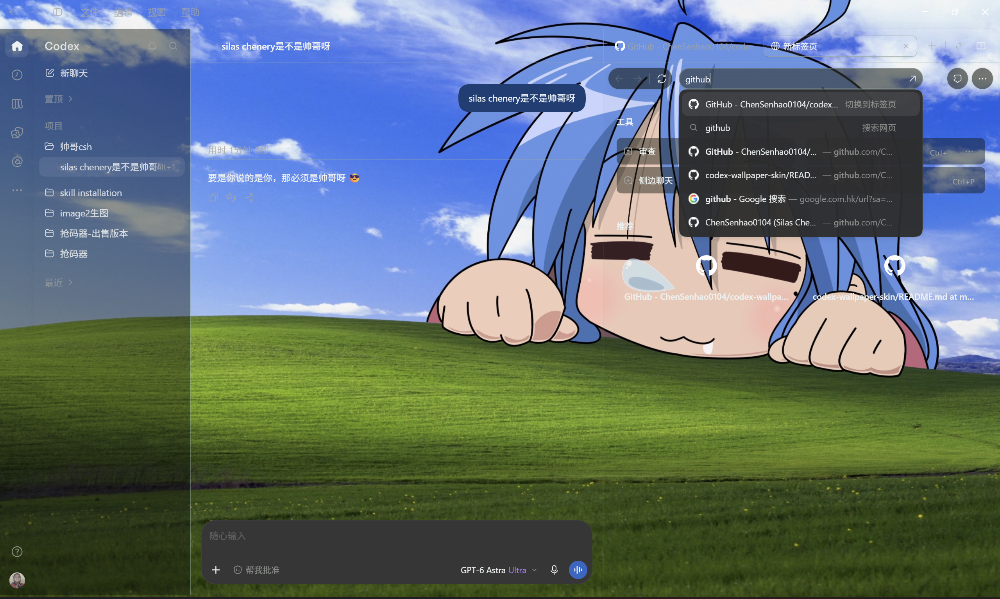
</p>

### Background adaptation across visual styles

<table>
  <tr>
    <td align="center" width="33%">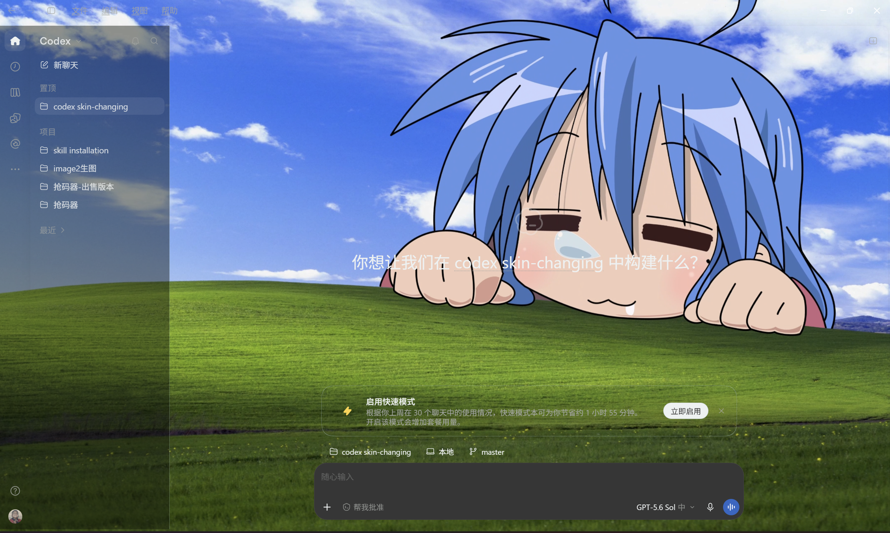</td>
    <td align="center" width="33%">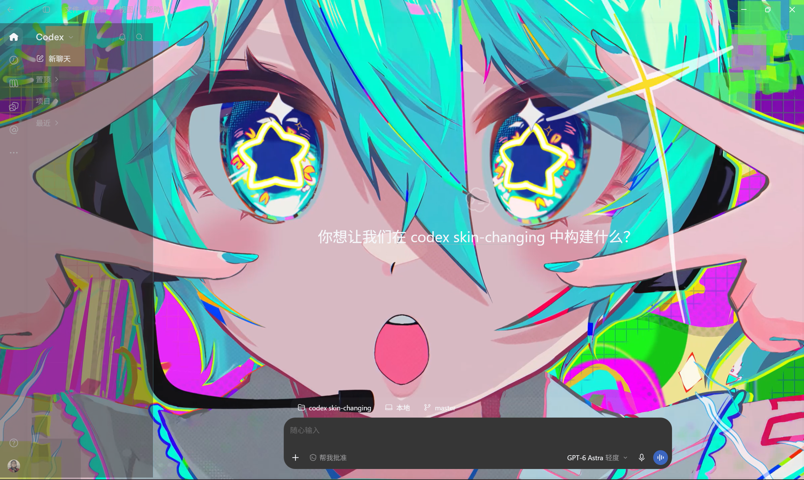</td>
    <td align="center" width="33%">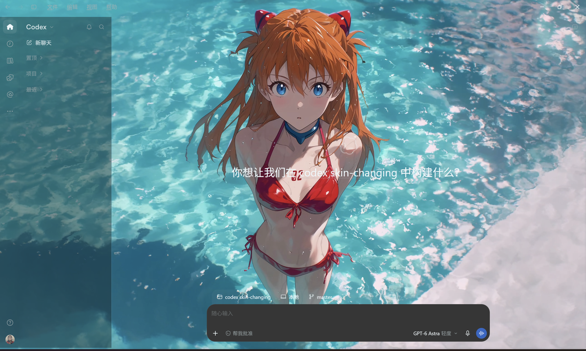</td>
  </tr>
  <tr>
    <td align="center"><strong>Soft, low contrast</strong></td>
    <td align="center"><strong>High saturation and contrast</strong></td>
    <td align="center"><strong>Bright, complex texture</strong></td>
  </tr>
</table>

### Background opacity and interface readability

<table>
  <tr>
    <td align="center" width="33%">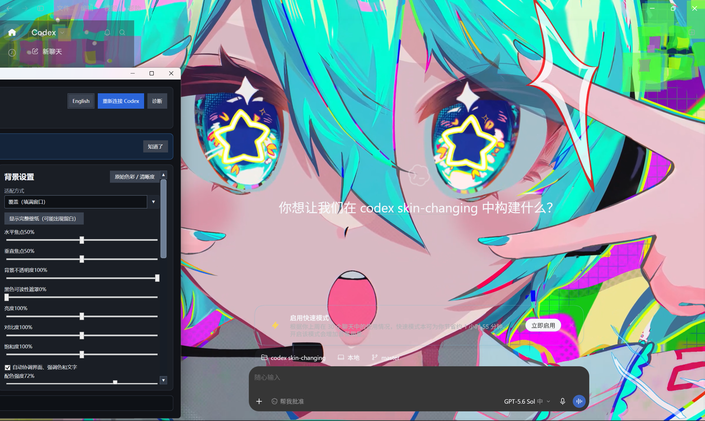</td>
    <td align="center" width="33%">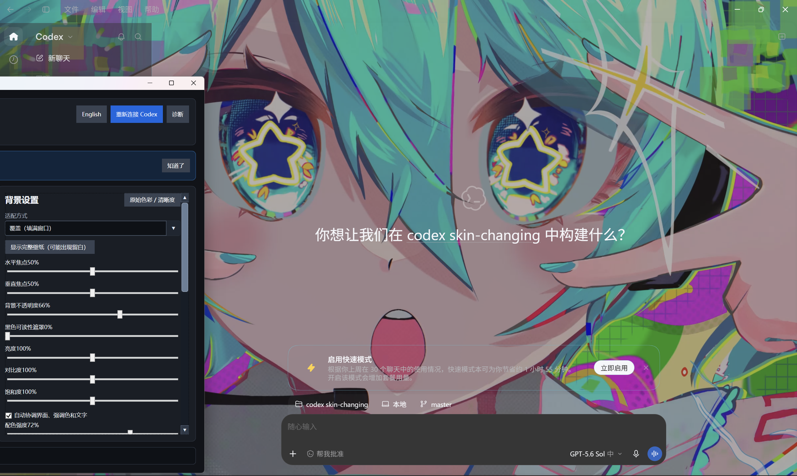</td>
    <td align="center" width="33%">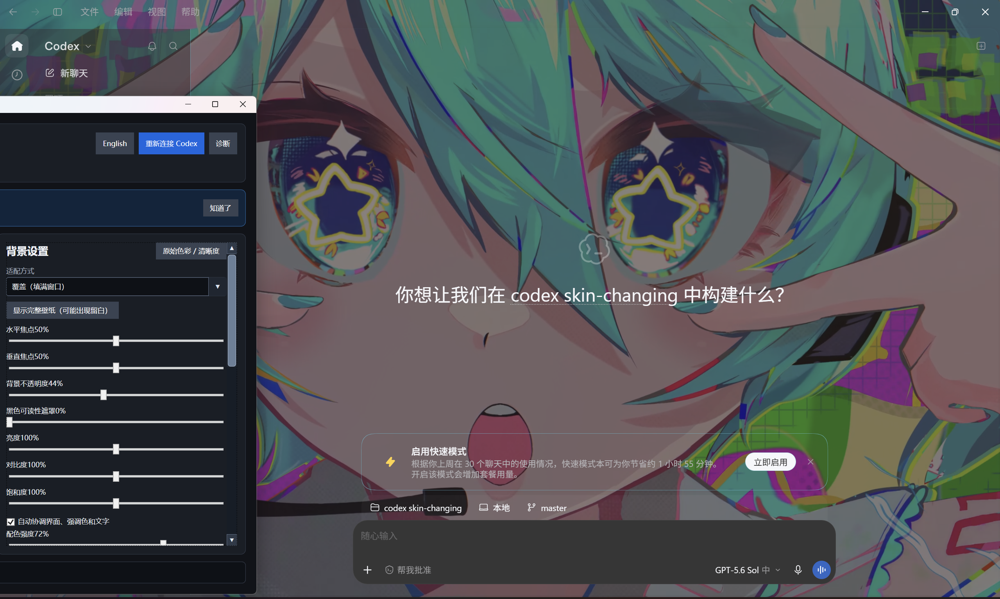</td>
  </tr>
  <tr>
    <td align="center"><strong>100% · Full background impact</strong></td>
    <td align="center"><strong>66% · Balanced readability</strong></td>
    <td align="center"><strong>44% · High-readability interface</strong></td>
  </tr>
</table>

### Multimedia wallpapers and Wallpaper Engine support

<table>
  <tr>
    <td align="center" width="33%">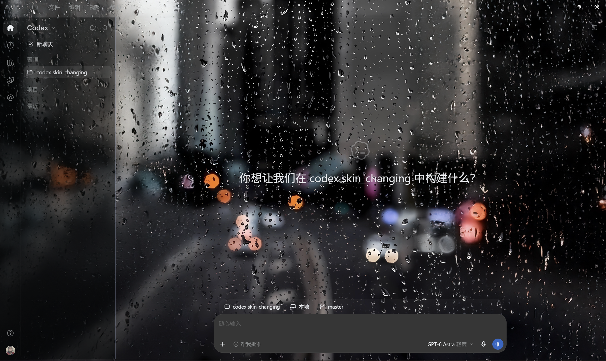</td>
    <td align="center" width="33%"><a href="https://github.com/ChenSenhao0104/codex-wallpaper-skin/releases/download/v0.8.0/demo-video-frog.mp4"></a></td>
    <td align="center" width="33%"><a href="https://github.com/ChenSenhao0104/codex-wallpaper-skin/releases/download/v0.8.0/demo-wallpaper-engine-live-scene.mp4"></a></td>
  </tr>
  <tr>
    <td align="center"><strong>Image · PNG / JPEG / WebP</strong></td>
    <td align="center"><strong>Video · MP4 / WebM</strong><br><a href="https://github.com/ChenSenhao0104/codex-wallpaper-skin/releases/download/v0.8.0/demo-video-frog.mp4">▶ Watch the HD MP4</a></td>
    <td align="center"><strong>Wallpaper Engine · Live Scene</strong><br><a href="https://github.com/ChenSenhao0104/codex-wallpaper-skin/releases/download/v0.8.0/demo-wallpaper-engine-live-scene.mp4">▶ Watch the HD MP4</a></td>
  </tr>
</table>

### Real-world result and controller interface

<table>
  <tr>
    <td align="center" width="33%">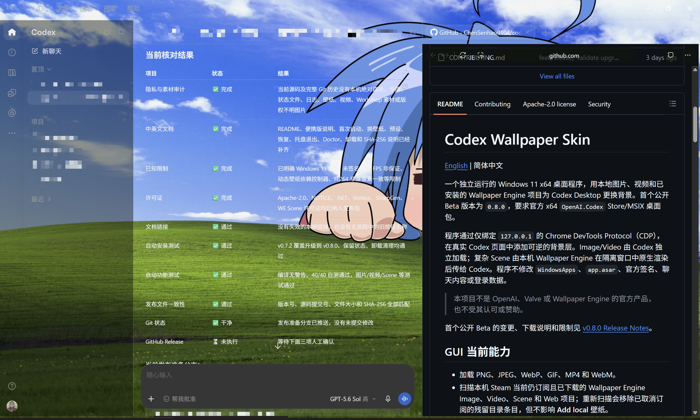</td>
    <td align="center" width="33%">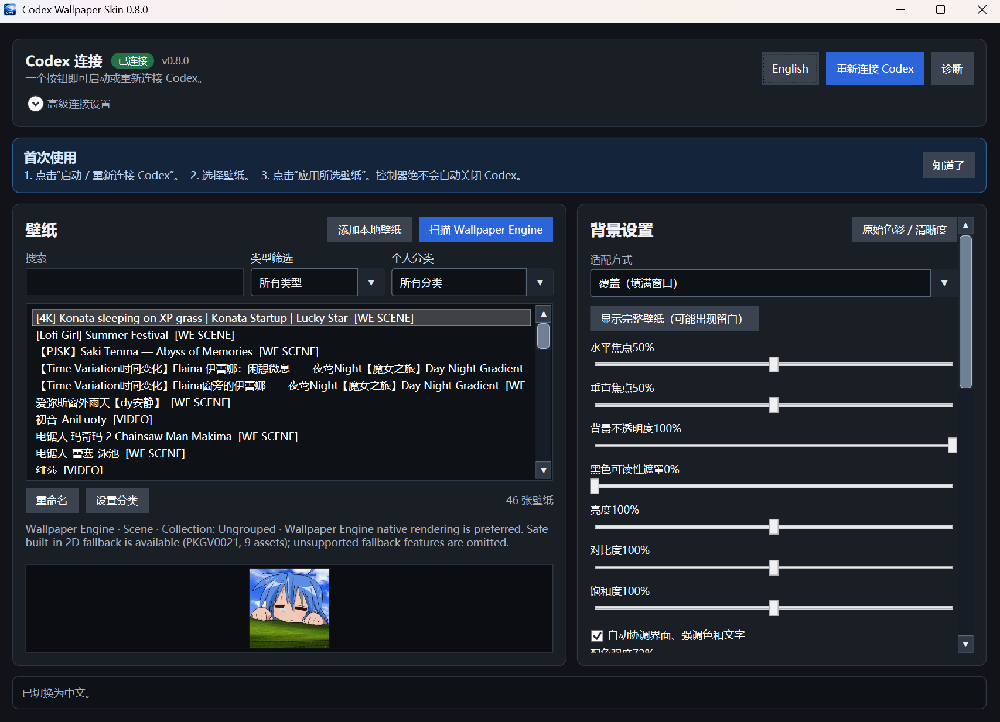</td>
    <td align="center" width="33%">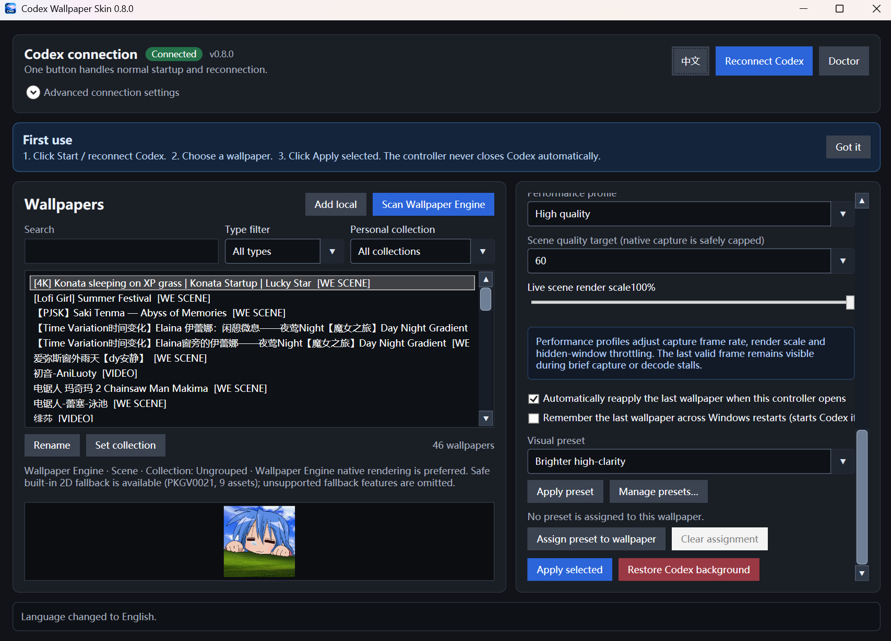</td>
  </tr>
  <tr>
    <td align="center"><strong>Codex workspace background</strong></td>
    <td align="center"><strong>Chinese controller</strong></td>
    <td align="center"><strong>English controller</strong></td>
  </tr>
</table>

> [!NOTE]
> Screenshots and recordings demonstrate local runtime behavior; click an animated preview for its HD MP4. The repository, installer, and portable package contain no importable Wallpaper Engine projects or original third-party wallpaper source files. Rights in third-party works visible in the demonstrations remain with their respective owners.

## Current GUI capabilities

- PNG, JPEG, WebP, GIF, MP4, and WebM media.
- Discovery of currently subscribed and downloaded Wallpaper Engine Image, Video, Scene, and Web projects across local Steam libraries. A rescan removes unsubscribed stale Workshop folders without affecting **Add local** entries.
- Original local media for Image and Video projects. Videos up to 256 MiB play directly in Codex; larger Wallpaper Engine videos use official `playInWindow` rendering and the native capture path instead of uploading the whole file.
- Scene projects prefer Wallpaper Engine's official `playInWindow` renderer and present its off-screen output in Codex. Puppet Warp, particles, author scripts, and audio response retain Wallpaper Engine's native semantics. The current stable H.264 path does not reproduce pointer interaction.
- If the native renderer is unavailable, the bounded built-in 2D renderer is used with an explicit compatibility warning, followed by an original package texture or validated Workshop preview when necessary.
- Web code is never executed; only validated animated/static previews are allowed. Application projects are always rejected.
- One-time 32×32 palette sampling for translucent surfaces, accents, and inherited interface text while code, terminal, warning, and status colors remain intact.
- Fit, focal point, opacity, readability veil, brightness, contrast, saturation, palette strength, panel opacity, inherited-text coordination, blur, animation speed, Scene FPS, and Scene render-scale controls. Click a displayed numeric value for exact entry. Create, name, edit, and delete multiple visual presets for wallpapers with different brightness and color; every value remains editable after applying one.
- Remembers the last successfully applied wallpaper and restores it on reconnect or Windows sign-in. If Codex is already running normally, the app asks the user to close Codex manually and then choose **Start / reconnect Codex**; it never closes the user's task.
- Personal collections, technical-type filters, instant search, and app-only renaming. Rescanning preserves the organization and never renames Workshop or local files.
- A top-level English/Chinese button switches the interface immediately and remembers the choice. **Start / reconnect Codex** is the only Codex startup and reconnection entry point.
- Decode-before-swap, preservation of the old background on failure, pause when hidden, bounded cleanup, and **Restore Codex background**.
- A live-stream watchdog checks the last frame actually presented by Codex. Silent capture, encode, transport, or decoder-presentation stalls receive at most two automatic recoveries, while intentional hidden-window pausing is exempt.
- 60 FPS H.264 frames are presented against their encoded timestamps and display refresh instead of drawing an entire batch immediately and then pausing. A lagging queue drops old frames to remain low-latency. The local high-quality 60 FPS bitrate ceiling is raised to 60 Mbps, while a large reusable NV12 conversion buffer reduces memory churn.
- **Doctor** reports watchdog health, frame counters, measured capture/encode/presentation FPS, dimensions, average timings, bitrate, recovery count, and the latest recovery reason. Copied/exported reports redact user names, absolute paths, page identifiers, session URL parameters, and task-bearing titles; ZIP logs receive the same redaction.
- A per-user installer that needs no elevation. Upgrades preserve the wallpaper library, presets, and settings; uninstall offers to retain or remove this app's user data and never closes Codex.
- The window title exposes the actual application version. Release builds emit a machine-readable manifest containing sizes, SHA-256 hashes, source revision, and Authenticode status.

Complex Scenes are rendered by Wallpaper Engine itself. Wallpaper Engine must be installed and remain available in the background; closing the visible controller keeps it running in the notification area. The current stable H.264 path does not reproduce pointer interaction, and the built-in renderer remains only as an explicitly labeled fallback.

## Quick start

For ordinary use, download `CodexWallpaperSkin-Setup-vX.Y.Z-win-x64.exe` and its `.sha256`, verify the hash, and run the installer. A portable ZIP remains available: extract it completely before running `CodexWallpaperSkin.exe`. Both distributions are self-contained and need no Python, PyYAML, Node.js, or .NET installation.

1. Run the application and choose **Start / reconnect Codex**. Detection, controlled startup, and reconnection are automatic; normal use does not require entering a CDP endpoint or AUMID.
2. If Codex is already running normally, close Codex manually and then choose **Start / reconnect Codex**. The controller never closes or restarts Codex automatically.
3. Choose **Scan Wallpaper Engine**, select a wallpaper, and review the controls.
4. Choose **Apply selected**. Use **Restore Codex background** when finished. Endpoint and package-identity controls remain available only inside the collapsed advanced section.

A fresh state enables palette coordination, inherited-text coordination, mute, and pause-when-hidden. Opacity, brightness, contrast, and saturation start at their original values; the black veil and blur start at `0`. **Original color / clarity** restores all image-affecting controls to neutral values.

After the first successful Apply, the controller remembers that wallpaper. Windows cannot dynamically add Chromium debugging flags to an existing Codex process, so safe in-place injection is impossible in that state. The app detects it immediately and stores the selection, but does not close Codex. Close Codex manually and choose **Start / reconnect Codex**. Windows sign-in restore is optional.

## Wallpaper Engine labels

| Label | Behavior |
|---|---|
| `[IMAGE]` | Loads the project's original image independently. |
| `[VIDEO]` | Loops the project's MP4/WebM independently. |
| `[WE NATIVE VIDEO]` | Lets Wallpaper Engine play a large MP4/WebM and presents it through native capture and hardware H.264. |
| `[WE LIVE SCENE]` | Uses native Wallpaper Engine rendering and bridges animation. The stable H.264 path does not forward pointer interaction and reports any fallback explicitly. |
| `[ANIMATED PREVIEW]` | Uses a validated GIF preview if the package is unavailable. |
| `[STATIC FALLBACK]` | Uses a validated static preview. |
| `[REJECTED]` | The project type or media failed the safety boundary and cannot be applied. |

## Performance and security

Static images have the lowest overhead. Video decodes in Codex. High-fidelity Scenes use Wallpaper Engine rendering, Windows Graphics Capture/D3D11, hardware H.264 encoding, and loopback transfer, subject to Wallpaper Engine's global frame-rate limit and the 50%–100% render scale. Keep blur at `0`, use the 30 FPS Power saver profile, lower Scene scale, and enable pause-when-hidden for a lighter setup.

Frames travel only through loopback CDP into Codex renderer memory and are never uploaded by this app. High-fidelity Scenes execute inside the user's installed Wallpaper Engine and follow its security/performance settings; this app does not interpret SceneScript itself. Web wallpaper code and Application wallpapers are never run. Other processes under the same Windows user can still reach an unauthenticated CDP port, so use it only in a trusted session and fully exit the CDP-enabled Codex process to close the port.

No Wallpaper Engine media is bundled or redistributed. Users must own Wallpaper Engine and follow each wallpaper author's license. See [SECURITY.md](SECURITY.md) for private vulnerability reporting.

## Beta known limitations

- Only Windows 11 x64 and the official x64 `OpenAI.Codex` Store/MSIX desktop package are supported. ARM64, x86, unpackaged, and renamed copies are unsupported.
- Wallpaper Engine Scene projects and large Video projects require the user to own and install Wallpaper Engine and keep it available in the background. Ordinary local images and supported smaller videos do not require Wallpaper Engine.
- The controller owns capture, encoding, and recovery for dynamic backgrounds. Closing its visible window keeps it in the notification area; choosing **Remove wallpaper and exit** stops dynamic playback.
- A Codex process started normally has no wallpaper channel. Close it manually and choose **Start / reconnect Codex**. This application never closes or restarts Codex automatically.
- Scene clarity, frame rate, and resource use depend on wallpaper complexity, Wallpaper Engine settings, GPU, display resolution, and system load. `60 FPS` is a target, not a guarantee. Doctor values are diagnostic evidence, not a standalone visual-quality score.
- The stable H.264 4:2:0 path does not forward pointer interaction and cannot be pixel-identical to Wallpaper Engine's direct desktop composition.
- The `0.8.0` installer is not code-signed, so Windows may show an unknown-publisher or SmartScreen warning. Download only from this repository's GitHub Releases, verify the adjacent SHA-256 file, and do not disable Windows security globally.

To verify a download, open PowerShell in the download directory and compare the computed value with the matching `.sha256` file:

```powershell
Get-FileHash .\CodexWallpaperSkin-Setup-v0.8.0-win-x64.exe -Algorithm SHA256
Get-Content .\CodexWallpaperSkin-Setup-v0.8.0-win-x64.exe.sha256
```

## Development and verification

Building requires the .NET 8 SDK; the full runtime test suite also needs Node.js, and installer builds need Inno Setup 7. See [THIRD_PARTY_NOTICES.md](THIRD_PARTY_NOTICES.md) for dependencies and licenses.

```powershell
pwsh -NoProfile -File .\scripts\build-companion.ps1
dotnet .\companion\bin\Debug\net8.0-windows10.0.19041.0\win-x64\CodexWallpaperSkin.dll --self-test
node .\scripts\runtime-smoke-test.mjs
dotnet .\companion\bin\Debug\net8.0-windows10.0.19041.0\win-x64\CodexWallpaperSkin.dll --wgc-smoke-test
```

On a development machine with Wallpaper Engine scenes installed:

```powershell
node .\scripts\scene-render-smoke-test.mjs
dotnet .\companion\bin\Debug\net8.0-windows10.0.19041.0\win-x64\CodexWallpaperSkin.dll --we-capture-smoke-test "D:\...\project.json"
```

Create the self-contained executable, portable ZIP, and SHA-256 file with:

```powershell
pwsh -NoProfile -File .\scripts\build-companion.ps1 -Configuration Release -Publish
```

With Inno Setup 7 installed, build the verified per-user installer and SHA-256 file with:

```powershell
pwsh -NoProfile -File .\scripts\build-installer.ps1
```

After exiting the running controller, validate a real upgrade from the previous stable installer to the current candidate. The test installs the old version, upgrades it in place, runs the upgraded self-test, uninstalls it, and verifies that `state.json` and `library.json` were never modified:

```powershell
pwsh -NoProfile -File .\scripts\installer-cross-version-smoke-test.ps1 `
  -PreviousSetupPath ".\dist\CodexWallpaperSkin-Setup-v0.6.2-win-x64.exe" `
  -CurrentSetupPath ".\dist\CodexWallpaperSkin-Setup-v0.8.0-win-x64.exe"
```

When a code-signing certificate is available in the current user's certificate store, sign both the inner executable and final installer without copying a private key into the repository or release directory:

```powershell
pwsh -NoProfile -File .\scripts\build-installer.ps1 `
  -CertificateThumbprint "40-hex-character certificate thumbprint" `
  -TimestampUrl "https://your-certificate-provider.example/timestamp"
```

Without a certificate, the same command still produces test packages and records `NotSigned` in `release-manifest.json`; it never labels an unsigned artifact as signed. `.github/workflows/release-candidate.yml` builds the previous stable baseline from `main` and runs an isolated stable-to-candidate install, in-place upgrade, self-test, and uninstall sequence without automatically publishing a Release.

`SKILL.md`, `agents/`, and `references/` are retained only as possible future Codex integration entry points. They are not part of the current GUI delivery and are not used by the portable application. See the [Apache-2.0 license](LICENSE) and [third-party notices](THIRD_PARTY_NOTICES.md).
